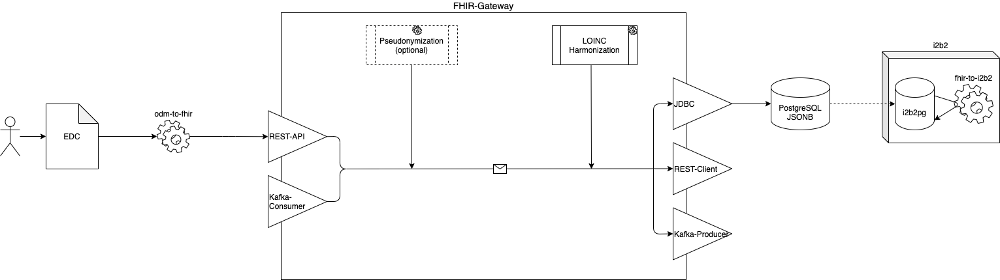

# NUM-Knoten v2

This repository contains the deployment package for the CODEX NUM-Knoten.

Currently, this is **v1.9beta** and does not contain all of the planned components (e.g. no GECCO-Merger that merges data from EDC and clinical source systems).

## Deployment on Single Host

### Start

`$ sh 01_start-single-host-environment.sh`

### Stop

`$ sh 02_remove-single-host-environment.sh`

### Test

#### Test from FHIR-GW on

`$ sh 03_send-test-resource-to-fhir-gw.sh`

#### Test from odm2fhir on

`$ sh 04_execute-odm2fhir.sh`

Note: The default settings use test-data in odm2fhir. To execute with real data, please set up odm2fhir/docker-compose.yml according to the documentation on <https://github.com/num-codex/odm2fhir/packages/496804>.

### URLs and Default Credentials

| Component                    | URL                                              | Default User | Default Password |
|------------------------------|--------------------------------------------------|--------------|------------------|
| FHIR-GW API                  | <http://localhost:18080/fhir>                    | -            | -                |
| FHIR-GW DB JDBC              | <jdbc:postgresql://localhost:15432/fhir>         | postgres     | postgres         |
| gPAS SOAP API                | <http://localhost:18081/gpas/gpasService?wsdl>   | -            | -                |
| gPAS Domain Service SOAP API | <http://localhost:18081/gpas/DomainService?wsdl> | -            | -                |
| gPAS Web UI                  | <http://localhost:18081/gpas-web>                | -            | -                |
| i2b2 Web UI                  | <http://localhost/webclient/>                    | miracum      | demouser         |
| i2b2 DB JDBC                 | <jdbc:postgresql://localhost:25432/i2b2>         | i2b2         | demouser         |
